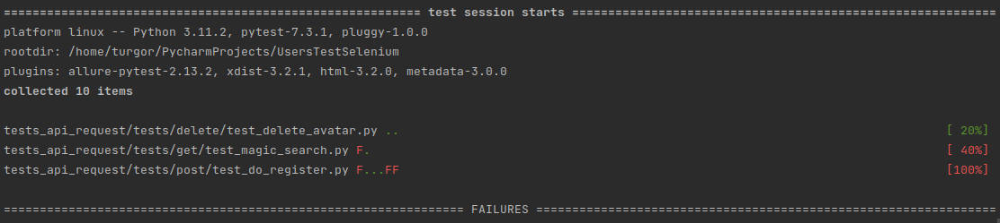
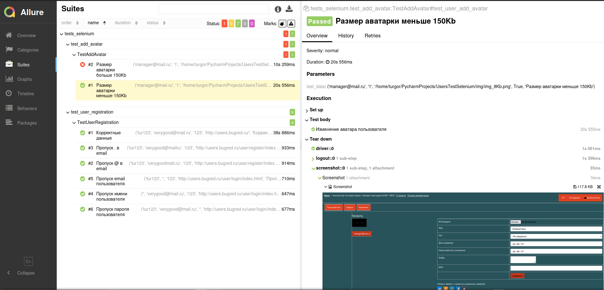
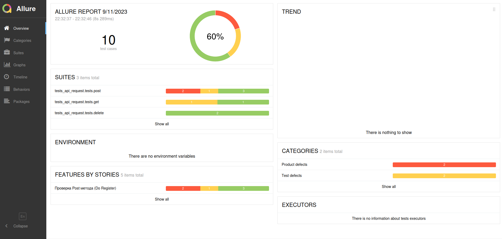
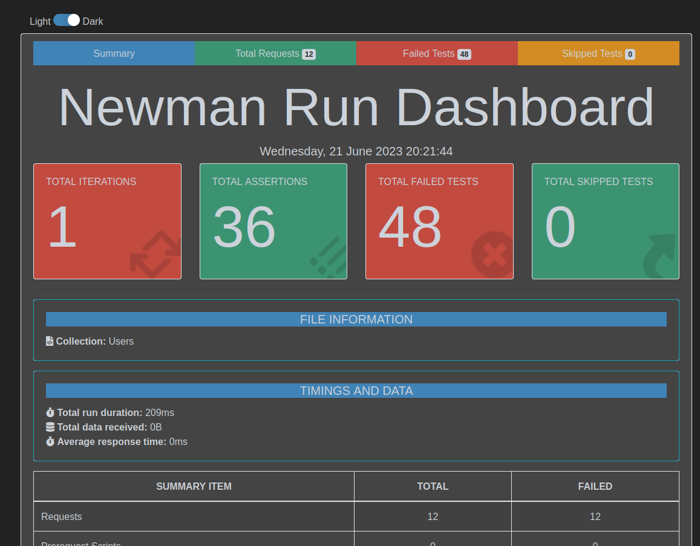
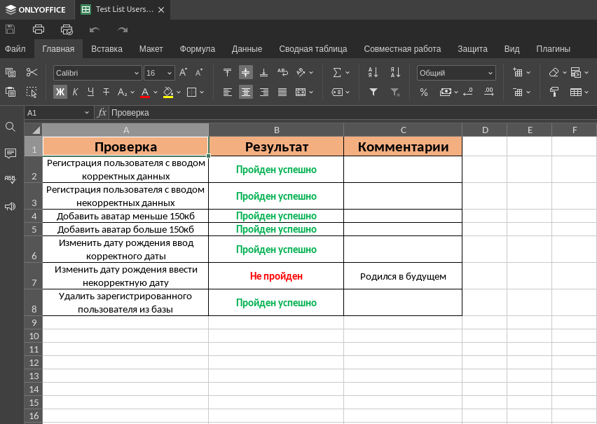

#  UsersTestSelemium

### Описание

Цель проекта: получение навыков в написание автоматизированных тестов на Python
и написание API запросов для Postman на примере веб-сайта (<a href="http://users.bugred.ru/">users</a>).

## Технологии

- Python 3.11.2
- Selenium
- Request
- Pydantic
- PyTest
- Postman
- Allure
- CSV

## Состав проекта

- Файлы (tests_selenium) с Python тестами
- Файлы (tests_api_request) с Python API тестами
- Файлы (test_api_postman) с API тестами 
- Файлы (test_documentation) с тест кейсами и чек листом к API тестам (Selenium)

## Окружение

Перед тем как запускать тесты нужно установить необходимые зависемости 
Введите следующую команду (нужно находиться внутри папки проекта): 
<b>pip install -r requirements.txt</b> 

Для запуска Selenium тестов требуется установить <a href="https://github.com/mozilla/geckodriver/releases/">WebDriver</a>,
а также браузер <a href="https://github.com/mozilla/geckodriver/releases/">Firefox</a>

## Запуск тестов

### Selenium

Для запуска Selenium тестов нужно ввести следующую команду 
<b>py.test --alluredir=allure_report_selenium tests_selenium</b> 

Для просмотра результатов тестов 
<b>allure serve allure_report_selenium</b>

### API

Для запуска API тестов нужно ввести следующую команду: 
<b>py.test --alluredir=allure_report_api tests_api_request/</b> 

Для просмотра отчёта: 
<b>allure serve tests_api_request</b>

## Selenium тесты

Пример запуска Selenium тестов:

## Python API тесты

Пример запуска API тестов:

## Report Selenium Allure

## Report API Allure

## Postman

Пример запуска тестов в Postman:

## Report Postman

## Test Case

## Test List

