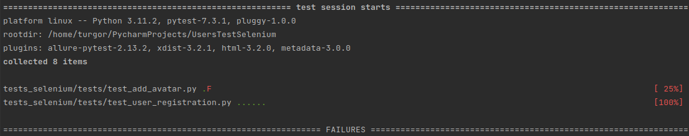
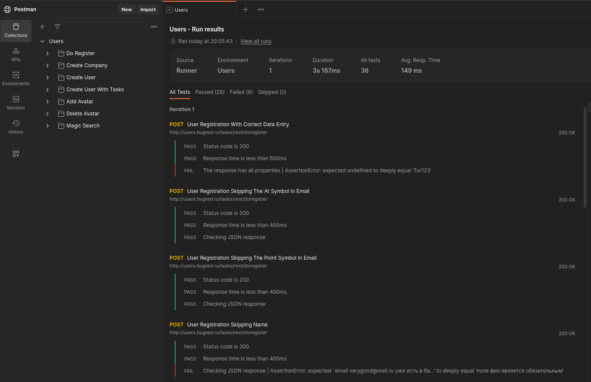

#  UsersTestSelemium

### Описание

## Технологии

- Python 3.10.9
- Selenium
- PyTest
- Postman

## Selenium тесты

Пример запуска тестов в Selenium:

## Postman

Пример запуска тестов в Postman:

## Test Case

Пример тест кейсов для API запросов Postman:

## Будущие изменения

- [X] Сделать фикстуру удаления пользователя
- [X] Сделать фикстуру выхода пользователя из аккаунат