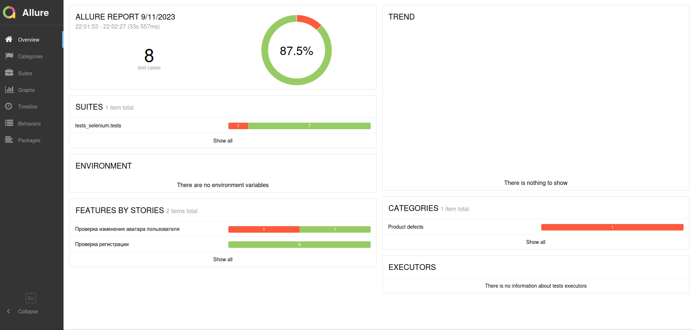

#  UsersTestSelemium

### Описание

Цель проекта: получение навыков в написание автоматизированных тестов на Python
и написание API запросов для Postman на примере веб-сайта (<a href="http://users.bugred.ru/">users</a>).

## Технологии

- Python 3.10.9
- Selenium
- PyTest
- PyTest-html
- request
- Postman

## Состав проекта

- Файлы (tests_selenium) с Python тестами
- Файлы (tests_api_python) с Python API тестами
- Файлы (test_api_postman) с API тестами 
- Файлы (test_case) с тест кейсами к API тестам (Selenium)
- Файлы (test_list) с тест листами к API тестам (Selenium)

## Окружение

## Запуск тестов

## Selenium тесты

Пример запуска Selenium тестов:
Для запуска тестов надо ввести следующую команду: 
<b>py.test --alluredir=allure_report tests_selenium</b> 
Для просмотра отчёта: 
<b>allure serve allure_report</b>

## Python API тесты

Пример запуска API тестов:

## Report Selenium Allure

## Report Selenium

## Postman

Пример запуска тестов в Postman:

## Report Postman

## Test Case

Пример тест кейсов для API запросов Postman:

## Test List

Пример тест листов для API запросов Postman:

## Будущие изменения

- [X] Сделать фикстуру удаления пользователя
- [X] Сделать фикстуру выхода пользователя из аккаунат
- [X] Добавить API python тесты
- [X] Добавить API test list
- [X] Добавить Reports
- [X] Добавить Allure отчёты
